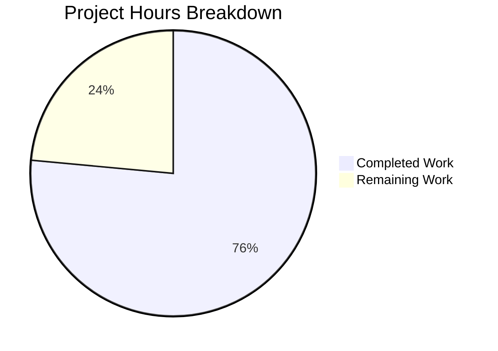

# Asterisk Pyramid Generator — Project Guide

## 1. Executive Summary

**Project**: Asterisk Pyramid Generator — A standalone Java 21 console application that prints a centered pyramid pattern of asterisks to the console.

**Completion**: 13 hours completed out of 17 total estimated hours = **76.5% complete**.

This was a greenfield project starting from an empty repository containing only a placeholder `README.md`. The Blitzy agents successfully created the entire Java/Maven project from scratch, including build configuration, core application logic, comprehensive test suite, and full documentation. All 6 planned files have been created/modified, all code compiles without errors, all 11 unit tests pass, the executable JAR packages correctly, and runtime validation confirms correct behavior across multiple scenarios (default mode, custom input, error handling).

**Key Achievements:**
- Complete Maven project structure established with Java 21 compilation and JUnit 5.11.4 testing
- Core pyramid algorithm implemented with reusable `printPyramid()` and testable `generatePyramid()` methods
- Entry point with dynamic user input via Scanner, including comprehensive input validation
- 11 JUnit 5 tests covering default output, custom rows, alignment, formula validation, and edge cases
- Comprehensive README with build/run instructions, example output, and project structure diagram
- Zero compilation errors, zero test failures, zero runtime errors

**Critical Unresolved Issues**: None. All in-scope functionality is fully implemented and validated.

**Remaining Work (4 hours)**: Human code review, environment verification on target machines, cross-platform JAR testing, and PR merge/post-merge verification.

---

## 2. Validation Results Summary

### 2.1 Files Processed

All 6 planned files were successfully created/modified by the Blitzy agents:

| # | File | Action | Lines | Status |
|---|------|--------|-------|--------|
| 1 | `pom.xml` | CREATED | 71 | ✅ Complete |
| 2 | `.gitignore` | CREATED | 52 | ✅ Complete |
| 3 | `src/main/java/com/pyramid/PyramidGenerator.java` | CREATED | 155 | ✅ Complete |
| 4 | `src/main/java/com/pyramid/Main.java` | CREATED | 123 | ✅ Complete |
| 5 | `src/test/java/com/pyramid/PyramidGeneratorTest.java` | CREATED | 267 | ✅ Complete |
| 6 | `README.md` | MODIFIED | 170 | ✅ Complete |

**Total**: 837 lines added, 1 line removed across 6 commits.

### 2.2 Dependency Installation

✅ **100% SUCCESS** — All Maven Central dependencies resolved successfully:
- `org.junit.jupiter:junit-jupiter:5.11.4` (test scope) with transitive dependencies
- `maven-compiler-plugin:3.13.0` (Java 21 compilation)
- `maven-surefire-plugin:3.5.2` (JUnit 5 test execution)
- `maven-jar-plugin:3.4.2` (executable JAR packaging with Main-Class manifest)

### 2.3 Compilation Results

✅ **100% SUCCESS** — `mvn clean compile -B`
- 2 source files compiled with javac targeting Java 21
- 0 errors, 0 warnings
- BUILD SUCCESS in 1.2 seconds

### 2.4 Test Results

✅ **100% SUCCESS** — `mvn test -B`
- Tests run: **11**, Failures: **0**, Errors: **0**, Skipped: **0**
- Test execution time: 0.080 seconds

Test breakdown by group:
| Group | Tests | Description |
|-------|-------|-------------|
| Default 15-Row Pyramid | 3 | Line count (15), first row (1 asterisk), last row (29 asterisks) |
| Custom Row Counts | 3 | Single row (1), five rows (5), ten rows (10) |
| Centering Alignment | 1 | Verifies leading spaces per row = `rows - i - 1` |
| Asterisk Formula | 1 | Verifies asterisk count per row = `2 * i - 1` |
| Edge Cases | 3 | Zero rows (empty string), negative -1 (exception), negative -100 (exception) |

### 2.5 Packaging Results

✅ **100% SUCCESS** — `mvn clean package -B`
- Executable JAR produced at `target/pyramid-generator-1.0.0.jar` (4,752 bytes)
- JAR manifest includes `Main-Class: com.pyramid.Main`
- BUILD SUCCESS in 3.0 seconds

### 2.6 Runtime Validation

✅ **100% SUCCESS** — All 4 runtime scenarios verified:

| Scenario | Input | Expected | Actual | Status |
|----------|-------|----------|--------|--------|
| Default 15-row | `15` | 15 rows, 1→29 asterisks | Correct centered output | ✅ Pass |
| Custom 5-row | `5` | 5 rows, 1→9 asterisks | Correct centered output | ✅ Pass |
| Invalid string | `abc` | Error message + exit code 1 | Error: Invalid input 'abc' | ✅ Pass |
| Negative integer | `-3` | Error message + exit code 1 | Error: must be positive | ✅ Pass |

### 2.7 Fixes Applied During Validation

No fixes were required during validation. All code worked correctly on first pass — zero compilation errors, zero test failures, zero runtime errors.

### 2.8 Git Status

✅ **Clean** — Working tree clean, all 6 files tracked and committed. No out-of-scope modifications or temporary files.

---

## 3. Hours Breakdown and Completion Calculation

### 3.1 Completed Hours (13h)

| Component | Files | Lines | Hours | Notes |
|-----------|-------|-------|-------|-------|
| Build configuration | pom.xml, .gitignore | 123 | 2.0 | Maven POM with 3 plugins, JUnit 5 dependency; comprehensive .gitignore |
| Core implementation | PyramidGenerator.java | 155 | 2.5 | Two public static methods with nested for-loops, input validation, full Javadoc |
| Entry point | Main.java | 123 | 2.0 | Scanner input, validation, error handling, welcome banner, delegation |
| Test suite | PyramidGeneratorTest.java | 267 | 3.0 | 11 JUnit 5 tests across 5 groups with @DisplayName annotations |
| Documentation | README.md | 170 | 1.5 | Complete rewrite with 7 sections, tables, code blocks, directory tree |
| Validation & debugging | — | — | 2.0 | Build verification, test execution, 4 runtime scenarios, git status |
| **Total Completed** | **6 files** | **838** | **13.0** | |

### 3.2 Remaining Hours (4h)

| Task | Base Hours | After Multipliers (×1.44) | Notes |
|------|-----------|--------------------------|-------|
| Human code review | 1.0 | — | Review 545 lines Java + 293 lines config/docs |
| Environment verification | 0.5 | — | Verify JDK 21 and Maven on target machines |
| Cross-platform JAR testing | 0.5 | — | Test on Windows, macOS, Linux |
| PR merge and verification | 0.5 | — | Merge to main, verify build |
| **Base subtotal** | **2.5** | | |
| Enterprise multiplier (compliance ×1.15, uncertainty ×1.25) | — | **1.5** | Applied to base subtotal |
| **Total Remaining** | | **4.0** | Rounded from 3.6h |

### 3.3 Completion Percentage Calculation

```
Completed Hours:  13h
Remaining Hours:   4h
Total Hours:      17h
Completion:       13 / 17 = 76.5%
```

**13 hours completed out of 17 total hours = 76.5% complete.**

---

## 4. Visual Representation



---

## 5. Detailed Remaining Task Table

| # | Task | Description | Action Steps | Hours | Priority | Severity |
|---|------|-------------|-------------|-------|----------|----------|
| 1 | Code Review | Review all Java source files, test coverage, and documentation for correctness and code quality | 1. Review PyramidGenerator.java algorithm and Javadoc. 2. Review Main.java input handling and validation. 3. Review PyramidGeneratorTest.java for test completeness. 4. Review pom.xml plugin versions and configuration. 5. Review README.md for accuracy. | 1.0 | High | Medium |
| 2 | Environment Setup Verification | Verify Java 21 and Maven installation on all target developer machines; confirm JAVA_HOME configuration | 1. Install JDK 21 on target machine. 2. Install Maven 3.8.7+. 3. Set JAVA_HOME environment variable. 4. Run `java --version` and `mvn --version` to verify. 5. Run `mvn clean package -B` to confirm build works. | 1.0 | High | Medium |
| 3 | Cross-Platform JAR Testing | Test the executable JAR on Windows, macOS, and Linux to verify consistent behavior | 1. Copy `pyramid-generator-1.0.0.jar` to each OS. 2. Test default 15-row mode. 3. Test custom row input. 4. Test invalid input handling. 5. Verify exit codes. | 1.0 | Medium | Low |
| 4 | PR Merge and Post-Merge Verification | Approve PR, merge to main branch, and verify build integrity after merge | 1. Approve the pull request after code review. 2. Merge to main branch. 3. Pull main branch and run `mvn clean package -B`. 4. Verify 11/11 tests pass. 5. Verify JAR runs correctly. | 1.0 | Medium | Low |
| | **Total Remaining Hours** | | | **4.0** | | |

---

## 6. Development Guide

### 6.1 System Prerequisites

| Tool | Required Version | Purpose |
|------|-----------------|---------|
| Java Development Kit (JDK) | OpenJDK 21.0.10+ (LTS) | Compilation and execution |
| Apache Maven | 3.8.7+ (tested with 3.9.12) | Build automation, dependency management, test execution |
| Git | 2.x+ | Version control |

### 6.2 Environment Setup

**Step 1: Clone the repository and switch to the feature branch**

```bash
git clone <repository-url>
cd <repository-directory>
git checkout blitzy-a90dea6d-ef17-41f1-a206-d3bd7fba7150
```

**Step 2: Verify Java 21 is installed and JAVA_HOME is set**

```bash
java --version
```

Expected output (version should be 21.x):
```
openjdk 21.0.10 2026-01-20 LTS
OpenJDK Runtime Environment Microsoft-13106404 (build 21.0.10+7-LTS)
OpenJDK 64-Bit Server VM Microsoft-13106404 (build 21.0.10+7-LTS, mixed mode, sharing)
```

If JAVA_HOME is not set, configure it:
```bash
# Linux/macOS
export JAVA_HOME=/path/to/jdk-21
export PATH="$JAVA_HOME/bin:$PATH"

# Windows (PowerShell)
$env:JAVA_HOME = "C:\Program Files\Microsoft\jdk-21.0.10.7-hotspot"
$env:PATH = "$env:JAVA_HOME\bin;$env:PATH"
```

**Step 3: Verify Maven is installed**

```bash
mvn --version
```

Expected output (version should be 3.8.7+):
```
Apache Maven 3.9.12 (848fbb4bf2d427b72bdb2471c22fced7ebd9a7a1)
Maven home: /path/to/maven
Java version: 21.0.10, vendor: Microsoft
```

### 6.3 Dependency Installation

Maven handles all dependency resolution automatically. Run from the project root (where `pom.xml` is located):

```bash
mvn dependency:resolve -B
```

This downloads JUnit Jupiter 5.11.4 and all transitive dependencies to your local Maven repository (`~/.m2/repository/`).

### 6.4 Build Commands

**Compile the project:**
```bash
mvn clean compile -B
```
Expected: `BUILD SUCCESS`, 2 source files compiled, 0 errors.

**Run all unit tests:**
```bash
mvn test -B
```
Expected: `Tests run: 11, Failures: 0, Errors: 0, Skipped: 0`, `BUILD SUCCESS`.

**Build executable JAR (compile + test + package):**
```bash
mvn clean package -B
```
Expected: `BUILD SUCCESS`, JAR at `target/pyramid-generator-1.0.0.jar`.

### 6.5 Application Startup and Execution

**Default 15-row pyramid (piped input):**
```bash
echo "15" | java -jar target/pyramid-generator-1.0.0.jar
```

**Custom row count (piped input):**
```bash
echo "5" | java -jar target/pyramid-generator-1.0.0.jar
```

**Interactive mode (manual input):**
```bash
java -jar target/pyramid-generator-1.0.0.jar
```
Then type a positive integer at the prompt and press Enter.

### 6.6 Verification Steps

| Step | Command | Expected Result |
|------|---------|----------------|
| 1. Compile | `mvn clean compile -B` | BUILD SUCCESS, 0 errors |
| 2. Test | `mvn test -B` | 11 tests pass, 0 failures |
| 3. Package | `mvn clean package -B` | JAR created at target/ |
| 4. Run default | `echo "15" \| java -jar target/pyramid-generator-1.0.0.jar` | 15-row centered pyramid |
| 5. Run custom | `echo "5" \| java -jar target/pyramid-generator-1.0.0.jar` | 5-row centered pyramid |
| 6. Test invalid input | `echo "abc" \| java -jar target/pyramid-generator-1.0.0.jar` | Error message, exit code 1 |
| 7. Test negative input | `echo "-3" \| java -jar target/pyramid-generator-1.0.0.jar` | Error message, exit code 1 |

### 6.7 Troubleshooting

| Issue | Cause | Resolution |
|-------|-------|------------|
| `javac: invalid target release: 21` | JDK version < 21 | Install JDK 21 and set JAVA_HOME |
| `mvn: command not found` | Maven not in PATH | Install Maven 3.8.7+ and add to PATH |
| `no main manifest attribute` | Missing Main-Class in JAR | Run `mvn clean package -B` to rebuild |
| Tests fail with `ClassNotFoundException` | Stale build artifacts | Run `mvn clean test -B` for fresh build |

---

## 7. Risk Assessment

### 7.1 Technical Risks

| Risk | Severity | Likelihood | Mitigation |
|------|----------|-----------|------------|
| JDK version mismatch on target machines | Medium | Low | README specifies JDK 21 requirement; pom.xml enforces Java 21 source/target |
| Maven version incompatibility | Low | Very Low | Project uses standard Maven 3.x conventions; tested with 3.9.12 |
| Large row count causing console overflow | Low | Low | Application handles any positive integer; console width is a terminal constraint |

### 7.2 Security Risks

| Risk | Severity | Likelihood | Mitigation |
|------|----------|-----------|------------|
| Scanner input injection | Very Low | Very Low | Input is read as integer only; non-integer input is rejected with error |
| No sensitive data exposure | N/A | N/A | Application has no network access, no file I/O, no data persistence |

### 7.3 Operational Risks

| Risk | Severity | Likelihood | Mitigation |
|------|----------|-----------|------------|
| No CI/CD pipeline | Low | N/A | Explicitly out of scope; can be added in a future iteration with GitHub Actions |
| No code coverage tooling | Low | N/A | Explicitly out of scope; JaCoCo can be added later via Maven plugin |
| No logging framework | Very Low | N/A | Console application uses System.out directly; SLF4J unnecessary for this scope |

### 7.4 Integration Risks

| Risk | Severity | Likelihood | Mitigation |
|------|----------|-----------|------------|
| No external service dependencies | N/A | N/A | Self-contained application with zero external integrations |
| Internal integration (Main → PyramidGenerator) | Very Low | Very Low | Fully covered by 11 unit tests; static method calls with no state |

**Overall Risk Assessment**: **LOW** — The project is a simple, self-contained console application with no external dependencies, no network access, no data persistence, and comprehensive test coverage. All identified risks are low severity with straightforward mitigations.

---

## 8. Architecture Overview

```
Repository Root
├── pom.xml                                          # Maven build config (Java 21, JUnit 5.11.4)
├── .gitignore                                       # Exclusion rules for build artifacts, IDE files
├── README.md                                        # Complete project documentation
└── src/
    ├── main/java/com/pyramid/
    │   ├── Main.java                                # Entry point: user input, validation, delegation
    │   └── PyramidGenerator.java                    # Core logic: printPyramid(), generatePyramid()
    └── test/java/com/pyramid/
        └── PyramidGeneratorTest.java                # 11 JUnit 5 tests across 5 test groups
```

**Component Interaction:**
- `Main.java` → delegates to `PyramidGenerator.printPyramid(int)` for console output
- `Main.java` → uses `java.util.Scanner` for optional user input
- `PyramidGeneratorTest.java` → tests `PyramidGenerator.generatePyramid(int)` for String-based assertions

---

## 9. Git History

6 commits on branch `blitzy-a90dea6d-ef17-41f1-a206-d3bd7fba7150` (all by Blitzy Agent):

| Commit | Description |
|--------|-------------|
| `6f05f7c` | Setup: Add Maven pom.xml and .gitignore for Java 21 pyramid-generator project |
| `b2605f0` | Create production-ready .gitignore for Java/Maven Asterisk Pyramid Generator |
| `732a86f` | docs: Replace placeholder README with comprehensive documentation |
| `0798c63` | feat: add PyramidGenerator class with printPyramid and generatePyramid methods |
| `4df0c81` | Create Main.java — application entry point for Asterisk Pyramid Generator |
| `95f28b3` | Add JUnit 5 unit tests for PyramidGenerator class |

**Code Statistics**: 837 lines added, 1 line removed, 6 files changed.
