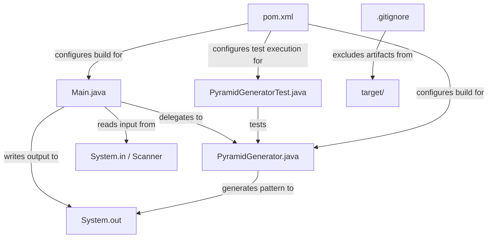
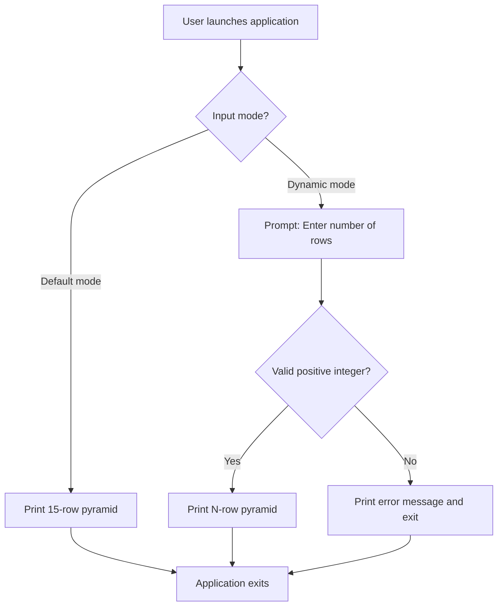

# Technical Specification

# 0. Agent Action Plan

## 0.1 Intent Clarification


### 0.1.1 Core Feature Objective

Based on the prompt, the Blitzy platform understands that the new feature requirement is to **create a standalone Java console application—"Asterisk Pyramid Generator"—that prints a centered pyramid pattern of asterisks (`*`) to the console**, with the following explicit and implicit requirements:

- **Primary Output**: Generate a perfectly centered pyramid composed of asterisks, defaulting to exactly **15 rows**, where the first row contains 1 asterisk and the last row contains 29 asterisks (following the formula `2n − 1`).
- **Centering Alignment**: Each row must be preceded by the appropriate number of leading spaces so the pyramid appears visually centered when printed to a fixed-width console.
- **Incremental Growth**: The number of asterisks increases by exactly **2** per row (1, 3, 5, 7, …, 29).
- **Dynamic Row Input (Optional Enhancement)**: Allow the user to specify the number of rows at runtime via standard input, overriding the default value of 15.
- **Input Validation (Optional Enhancement)**: When dynamic input is enabled, the program must validate that the supplied value is a positive integer and provide a meaningful error message otherwise.
- **Reusable Method (Optional Enhancement)**: Encapsulate the pyramid-printing logic within a reusable method with the signature `printPyramid(int rows)`, enabling invocation from any calling context.

**Implicit Requirements Detected:**

- The repository is currently empty (contains only a placeholder `README.md` with the text `# 12feb_3`). This means the entire Java project structure, build configuration, and documentation must be created from scratch.
- No build tool (Maven or Gradle) exists yet. A build system must be introduced to manage compilation, testing, and packaging.
- No testing framework is present. Unit and integration test infrastructure must be established alongside the feature code.
- The existing Technical Specification describes a Python-based system (`archie-job-reverse-document-generator`). This Java feature represents a greenfield addition introducing a new programming language to the repository.

### 0.1.2 Special Instructions and Constraints

- **Language Mandate**: The implementation must use **Java** exclusively, as explicitly stated by the user.
- **Loop-Based Construction**: The pyramid must be generated using loop constructs (`for` or `while`); hardcoding individual rows is explicitly prohibited.

  User Example (5-row pyramid):
  ```plaintext
      *
     ***
    *****
   *******
  *********
  ```

- **Clean and Commented Code**: The user requires the source code to be well-commented, with proper indentation and formatting throughout.
- **No Hardcoding**: Each row must not be hardcoded. The pattern must be computed algorithmically at runtime.
- **Architectural Freedom**: No existing architecture, service pattern, or repository convention needs to be followed since the repository is empty. The implementation will establish the initial project conventions.
- **Backward Compatibility**: Not applicable—there is no existing codebase to maintain compatibility with.

### 0.1.3 Technical Interpretation

These feature requirements translate to the following technical implementation strategy:

- To **establish the project foundation**, we will create a standard Maven project structure with a `pom.xml` defining Java 21 compilation, JUnit 5 test dependencies, and the Maven Compiler Plugin configuration.
- To **implement the core pyramid logic**, we will create a dedicated `PyramidGenerator` class in `src/main/java/com/pyramid/` containing a static `printPyramid(int rows)` method that uses nested `for` loops—one for leading spaces and one for asterisks—to build each row.
- To **provide a console entry point**, we will create a `Main` class in the same package with a `main(String[] args)` method that defaults to 15 rows, optionally reads user input via `java.util.Scanner`, and delegates to `PyramidGenerator.printPyramid()`.
- To **enforce input validation**, we will add guard logic in the `Main` class (and optionally in `PyramidGenerator`) to verify that the supplied row count is a positive integer, printing an informative error message and exiting gracefully if validation fails.
- To **ensure correctness**, we will create a JUnit 5 test class `PyramidGeneratorTest` that verifies output for known row counts (1, 5, 15), validates centering alignment, confirms the asterisk-count formula, and tests edge cases such as zero or negative inputs.
- To **document the project**, we will replace the placeholder `README.md` with comprehensive usage instructions, build commands, and an overview of the project structure.


## 0.2 Repository Scope Discovery


### 0.2.1 Comprehensive File Analysis

**Current Repository State:**

The repository was inspected via `get_source_folder_contents` (root path `""`) and `read_file` for `README.md`. The results confirm an effectively empty repository:

| File/Folder | Status | Content |
|---|---|---|
| `README.md` | Exists | Contains only `# 12feb_3` (placeholder heading) |
| `src/` | Does not exist | No source directory |
| `pom.xml` | Does not exist | No Maven build configuration |
| `build.gradle` | Does not exist | No Gradle build configuration |
| `*.java` | None found | No Java source files in the entire repository |
| `.github/` | Does not exist | No CI/CD workflows |

A `bash` search across the entire filesystem confirmed zero matches for `pom.xml`, `build.gradle`, `.java-version`, and `*.java` files within the repository.

**Existing Modules to Modify:**

| File | Action Required | Purpose |
|---|---|---|
| `README.md` | MODIFY | Replace placeholder content with full project documentation including build instructions, usage guide, and project overview |

**Integration Point Discovery:**

Since the repository is empty, there are no existing integration points to discover:
- No API endpoints exist.
- No database models or migrations are present.
- No service classes, controllers, handlers, or middleware require updates.
- No configuration files or environment variables are in use.

All integration points will be established as part of the new file creation.

### 0.2.2 Web Search Research Conducted

The following web research was conducted to inform the implementation approach:

- **Best practices for Java pyramid patterns**: Researched centered pyramid generation techniques using nested loops. Key findings confirm that the standard approach uses an outer loop for rows and two inner loops—one for leading spaces (`rows - i - 1` spaces) and one for asterisks (`2 * i + 1` stars)—per row.
- **JUnit 5 latest stable version**: Confirmed JUnit 5.11.4 as a well-established stable release compatible with Java 21. The JUnit 5.14.2 release is the latest in the 5.x lineage, while JUnit 6.0.2 has also been released (September 2025) with a Java 17 baseline.
- **Maven latest stable version**: Confirmed Apache Maven 3.9.12 as the current stable release. Maven 3.8.7 (installed via system package manager) is also fully functional for this project.
- **Java Scanner class for user input**: The `java.util.Scanner` class is the standard approach for reading console input in Java, supporting `nextInt()` for integer reading with exception-based validation.

### 0.2.3 New File Requirements

**New Source Files to Create:**

| File Path | Purpose |
|---|---|
| `src/main/java/com/pyramid/PyramidGenerator.java` | Core pyramid generation logic with reusable `printPyramid(int rows)` method and a helper `generatePyramid(int rows)` method that returns the pyramid as a `String` for testability |
| `src/main/java/com/pyramid/Main.java` | Application entry point with `main(String[] args)` method; handles default 15-row mode and optional dynamic user input via `Scanner` |

**New Test Files to Create:**

| File Path | Purpose |
|---|---|
| `src/test/java/com/pyramid/PyramidGeneratorTest.java` | JUnit 5 unit tests covering: default 15-row output, custom row counts (1, 5, 10), centering alignment verification, asterisk count formula validation, edge-case handling (0, negative numbers) |

**New Configuration Files to Create:**

| File Path | Purpose |
|---|---|
| `pom.xml` | Maven project descriptor defining groupId `com.pyramid`, artifactId `pyramid-generator`, Java 21 compiler settings, JUnit 5 dependency, and Maven plugin configurations |
| `.gitignore` | Git ignore rules for Java/Maven artifacts (`target/`, `*.class`, IDE files) |

**Documentation Files to Create or Modify:**

| File Path | Action | Purpose |
|---|---|---|
| `README.md` | MODIFY | Complete rewrite with project title, description, build prerequisites, compilation instructions, execution examples, and project structure overview |


## 0.3 Dependency Inventory


### 0.3.1 Private and Public Packages

Since this is a greenfield Java project with no existing dependency manifest, the following table captures all packages required for the feature implementation. Versions have been verified against official release pages and Maven Central.

| Registry | Package Name | Version | Scope | Purpose |
|---|---|---|---|---|
| System Runtime | OpenJDK | 21.0.10 | Runtime | Java Development Kit for compilation and execution; installed and verified on the build environment |
| System Tool | Apache Maven | 3.8.7+ | Build | Build automation and project management; manages compilation, testing, and packaging lifecycle |
| Maven Central | `org.junit.jupiter:junit-jupiter` | 5.11.4 | Test | JUnit 5 Jupiter test engine and API; provides `@Test`, assertions, and test lifecycle annotations |
| Maven Central | `org.junit.jupiter:junit-jupiter-api` | 5.11.4 | Test | JUnit 5 API for writing unit tests (transitive via `junit-jupiter`) |
| Maven Central | `org.junit.jupiter:junit-jupiter-engine` | 5.11.4 | Test | JUnit 5 test execution engine (transitive via `junit-jupiter`) |
| Maven Plugin | `maven-compiler-plugin` | 3.13.0 | Build Plugin | Configures Java source and target version to 21 for compilation |
| Maven Plugin | `maven-surefire-plugin` | 3.5.2 | Build Plugin | Executes JUnit 5 tests during the Maven `test` phase |
| Maven Plugin | `maven-jar-plugin` | 3.4.2 | Build Plugin | Packages compiled classes into a JAR with `Main-Class` manifest entry for executable JAR support |
| Java Standard Library | `java.util.Scanner` | (JDK 21) | Runtime | Standard library class for reading user input from the console; no external dependency required |

**Key Notes:**
- No private or internal packages are required for this project.
- All dependencies are publicly available on Maven Central.
- The `junit-jupiter` aggregate artifact transitively includes `junit-jupiter-api` and `junit-jupiter-engine`, simplifying the POM configuration.

### 0.3.2 Dependency Updates

Since the repository contains no existing code, there are no import updates, external reference updates, or migration paths required. All dependencies are being introduced fresh.

**Import Declarations to Establish (New Files):**

| Target File | Imports Required |
|---|---|
| `src/main/java/com/pyramid/Main.java` | `java.util.Scanner`, `java.util.InputMismatchException` |
| `src/main/java/com/pyramid/PyramidGenerator.java` | No external imports required (uses only `java.lang.*` which is auto-imported) |
| `src/test/java/com/pyramid/PyramidGeneratorTest.java` | `org.junit.jupiter.api.Test`, `org.junit.jupiter.api.DisplayName`, `static org.junit.jupiter.api.Assertions.*` |

**Build File Configuration (New):**

| File | Configuration Element | Value |
|---|---|---|
| `pom.xml` | `maven.compiler.source` | `21` |
| `pom.xml` | `maven.compiler.target` | `21` |
| `pom.xml` | `project.build.sourceEncoding` | `UTF-8` |
| `pom.xml` | JUnit 5 dependency scope | `test` |
| `pom.xml` | Main-Class manifest entry | `com.pyramid.Main` |


## 0.4 Integration Analysis


### 0.4.1 Existing Code Touchpoints

Since the repository is effectively empty (containing only a placeholder `README.md`), there are no existing code touchpoints that require modification in the traditional integration sense. All code is being created from scratch.

**Direct Modifications Required:**

| File | Modification | Details |
|---|---|---|
| `README.md` | Complete content replacement | Replace the placeholder `# 12feb_3` heading with comprehensive project documentation, including title, description, prerequisites, build instructions, usage guide, example output, and project structure |

**New Registrations and Wiring (Established via New Files):**

The following integration relationships will be established between new components:



- **`Main.java` → `PyramidGenerator.java`**: The entry-point class creates an instance or calls the static method `PyramidGenerator.printPyramid(int rows)` to render the pyramid. This is the primary internal integration point.
- **`Main.java` → `java.util.Scanner`**: For the optional dynamic input feature, `Main` instantiates a `Scanner` wrapping `System.in` to read the row count from the user.
- **`PyramidGeneratorTest.java` → `PyramidGenerator.java`**: The test class imports and exercises the `generatePyramid(int rows)` method (which returns a `String`) to verify correctness without depending on `System.out` capture.
- **`pom.xml` → All source and test files**: Maven's build lifecycle compiles sources under `src/main/java/`, executes tests under `src/test/java/`, and packages the result into `target/`.

**Database / Schema Updates:**

No database or schema changes are required. This feature is a pure console application with no persistence layer.

**Dependency Injection / Service Registration:**

No dependency injection framework is used. The application follows a simple static-method invocation pattern where `Main` directly calls `PyramidGenerator`.


## 0.5 Technical Implementation


### 0.5.1 File-by-File Execution Plan

Every file listed below MUST be created or modified as part of this feature addition. Files are grouped by functional role to ensure a logical implementation sequence.

**Group 1 — Build and Project Configuration:**

| Action | File Path | Purpose |
|---|---|---|
| CREATE | `pom.xml` | Maven Project Object Model defining `groupId=com.pyramid`, `artifactId=pyramid-generator`, `version=1.0.0`, Java 21 compiler configuration, JUnit 5.11.4 test dependency, `maven-compiler-plugin` (3.13.0), `maven-surefire-plugin` (3.5.2), and `maven-jar-plugin` (3.4.2) with `Main-Class` manifest entry |
| CREATE | `.gitignore` | Git exclusion rules for Maven build artifacts (`target/`), compiled classes (`*.class`), IDE metadata (`.idea/`, `*.iml`, `.vscode/`, `.settings/`, `.project`, `.classpath`), and OS files (`.DS_Store`, `Thumbs.db`) |

**Group 2 — Core Feature Files:**

| Action | File Path | Purpose |
|---|---|---|
| CREATE | `src/main/java/com/pyramid/PyramidGenerator.java` | Core pyramid generation class containing: (1) `printPyramid(int rows)` — static method that prints a centered asterisk pyramid to `System.out` using nested `for` loops; (2) `generatePyramid(int rows)` — static method that builds and returns the pyramid as a `String` using `StringBuilder`, enabling unit testing without I/O capture |
| CREATE | `src/main/java/com/pyramid/Main.java` | Application entry point with `main(String[] args)` that: (1) defaults to 15 rows when no input is provided; (2) optionally prompts the user for a custom row count via `Scanner`; (3) validates input is a positive integer; (4) delegates to `PyramidGenerator.printPyramid()` |

**Group 3 — Tests:**

| Action | File Path | Purpose |
|---|---|---|
| CREATE | `src/test/java/com/pyramid/PyramidGeneratorTest.java` | JUnit 5 test class with test methods covering: default 15-row pyramid dimensions (29 asterisks on last row, 1 on first), custom row counts (1, 5, 10), centering alignment (leading space count = `rows - currentRow`), asterisk formula verification (`2 * row - 1`), edge cases (0 rows returns empty string, negative input throws `IllegalArgumentException`) |

**Group 4 — Documentation:**

| Action | File Path | Purpose |
|---|---|---|
| MODIFY | `README.md` | Replace placeholder content with: project title ("Asterisk Pyramid Generator"), feature description, prerequisites (Java 21, Maven 3.8.7+), build commands (`mvn clean compile`, `mvn test`, `mvn package`), execution instructions (`java -jar target/pyramid-generator-1.0.0.jar`), example output preview, and directory structure diagram |

### 0.5.2 Implementation Approach per File

**`pom.xml` — Establish Build Foundation:**
Define the Maven project descriptor with the `com.pyramid` group, configure Java 21 source/target via `maven-compiler-plugin`, declare `junit-jupiter` 5.11.4 as a test-scoped dependency, and configure `maven-surefire-plugin` for JUnit 5 discovery. The `maven-jar-plugin` must include a `Main-Class` manifest attribute pointing to `com.pyramid.Main`.

**`PyramidGenerator.java` — Core Algorithm:**
Implement the pyramid algorithm using two nested `for` loops within the `printPyramid` method. The outer loop iterates from `i = 1` to `rows`. The first inner loop prints `(rows - i)` space characters for centering. The second inner loop prints `(2 * i - 1)` asterisk characters. Each row ends with `System.out.println()`. A parallel `generatePyramid` method uses `StringBuilder` to return the same pattern as a string for testability.

```java
// Core logic sketch (2 lines)
for (int j = 0; j < rows - i; j++) sb.append(" ");
for (int k = 0; k < 2 * i - 1; k++) sb.append("*");
```

**`Main.java` — Entry Point with Optional Input:**
The `main` method initializes `rows = 15` as the default. It prompts the user with a message asking whether to use the default or enter a custom value. Input is read via `Scanner.nextInt()`, wrapped in a `try-catch` for `InputMismatchException`. If the user enters a non-positive integer, the program prints an error and exits with code 1. Valid input triggers `PyramidGenerator.printPyramid(rows)`.

**`PyramidGeneratorTest.java` — Comprehensive Test Coverage:**
Each test method calls `PyramidGenerator.generatePyramid(n)` and asserts against expected properties: line count matches `n`, first line contains exactly 1 asterisk, last line contains `2n - 1` asterisks, leading spaces on row `i` equal `n - i`, and the output is symmetric. Edge-case tests verify that row count of 0 produces an empty string and negative values throw `IllegalArgumentException`.

**`README.md` — Project Documentation:**
Replace the existing single-line placeholder with structured Markdown documentation. Include sections for project overview, prerequisites, build instructions, run instructions, example output, project structure tree, and optional enhancements documentation.

**`.gitignore` — Repository Hygiene:**
Define ignore rules for `target/`, `*.class`, `.idea/`, `*.iml`, `.vscode/`, `.settings/`, `.project`, `.classpath`, `.DS_Store`, and `Thumbs.db`.

### 0.5.3 User Interface Design

No graphical or web-based user interface is applicable for this feature. The application interacts exclusively via the **command-line console** (standard input/output streams).

The console interaction flow is:



No Figma screens or UI mockups were provided for this project, and none are applicable.


## 0.6 Scope Boundaries


### 0.6.1 Exhaustively In Scope

The following is the complete and definitive list of all files, patterns, and concerns that fall within the scope of this feature implementation. Trailing wildcards are used where patterns apply.

**Source Files:**

| Pattern / Path | Description |
|---|---|
| `src/main/java/com/pyramid/**/*.java` | All Java source files under the pyramid package, specifically `PyramidGenerator.java` and `Main.java` |
| `src/main/java/com/pyramid/PyramidGenerator.java` | Core class: `printPyramid(int)`, `generatePyramid(int)` methods |
| `src/main/java/com/pyramid/Main.java` | Entry point: `main(String[])`, user input handling, validation |

**Test Files:**

| Pattern / Path | Description |
|---|---|
| `src/test/java/com/pyramid/**/*Test.java` | All JUnit 5 test classes for the pyramid package |
| `src/test/java/com/pyramid/PyramidGeneratorTest.java` | Unit tests for pyramid generation logic, alignment, edge cases |

**Build and Configuration:**

| Pattern / Path | Description |
|---|---|
| `pom.xml` | Maven project descriptor with Java 21 config, JUnit 5 dependency, plugin configuration |
| `.gitignore` | Git exclusion rules for build artifacts and IDE metadata |

**Documentation:**

| Pattern / Path | Description |
|---|---|
| `README.md` | Project documentation (modified from placeholder to full documentation) |

**Functional Scope:**

- Centered asterisk pyramid generation for any positive integer row count
- Default 15-row pyramid output
- Dynamic user input via console (optional enhancement)
- Input validation for non-integer and non-positive values
- Reusable `printPyramid(int rows)` method
- String-returning `generatePyramid(int rows)` method for testability
- JUnit 5 unit tests with edge-case coverage
- Maven build lifecycle (compile, test, package)
- Executable JAR packaging with `Main-Class` manifest

### 0.6.2 Explicitly Out of Scope

The following items are explicitly excluded from this implementation:

| Exclusion | Rationale |
|---|---|
| Reverse pyramid patterns | Not requested in the primary requirements; listed only as future possibilities by the user |
| Number pyramid patterns | Not requested; user mentioned as a potential follow-up |
| Hollow pyramid patterns | Not requested; user mentioned as a potential follow-up |
| Diamond patterns | Not part of the stated requirements |
| Web-based or GUI interface | The requirement specifies console output only |
| Database or persistence layer | No data storage is needed for pattern printing |
| REST API or network endpoints | The application is a standalone console tool |
| CI/CD pipeline configuration (`.github/workflows/`) | No CI/CD was requested; can be added in a future iteration |
| Docker containerization | Not requested for a simple console application |
| Integration with the existing `archie-job-reverse-document-generator` system | The Python-based system described in the tech spec is unrelated to this Java feature |
| Performance optimization or benchmarking | Beyond the scope of a pattern printing utility |
| Logging framework integration (e.g., SLF4J, Log4j) | Unnecessary for a simple console application |
| Code coverage tooling (e.g., JaCoCo) | Not requested; can be added later |
| Multi-module Maven project structure | The project is simple enough for a single module |


## 0.7 Rules for Feature Addition


### 0.7.1 User-Specified Rules and Requirements

The following rules are derived directly from the user's explicit instructions and must be enforced throughout the implementation:

- **Java Language Only**: The implementation must be written entirely in Java. No other programming languages, scripting engines, or polyglot approaches are permitted.
- **Loop-Based Pattern Generation**: The pyramid must be constructed using `for` or `while` loop constructs. The user explicitly stated: *"Use loops (`for` or `while`) to generate the pattern."*
- **No Hardcoding of Rows**: Individual rows must not be hardcoded as string literals. The user explicitly stated: *"Do not hardcode each row."* The pattern must be dynamically computed from the row-count parameter.
- **Clean and Well-Commented Code**: All Java source files must include meaningful inline comments explaining the logic. The user stated: *"Keep the code clean and well commented."*
- **Proper Indentation and Formatting**: Source code must follow standard Java formatting conventions (4-space indentation, opening braces on the same line, consistent spacing). The user stated: *"Use proper indentation and formatting."*
- **Exact Row Specification**: The default pyramid must consist of exactly **15 rows**, with the first row containing 1 asterisk and the last row containing 29 asterisks.
- **Asterisk Character**: The pyramid must use the asterisk character (`*`) exclusively. No other characters are to be used for the pattern body.
- **Centered Alignment**: The pyramid must appear visually centered when printed to the console, achieved through leading space characters.

### 0.7.2 Inferred Conventions and Standards

Since the repository is empty and no pre-existing conventions exist, the following standards will be established by this implementation and should be maintained for future additions:

- **Package Naming**: Use `com.pyramid` as the root package, following Java's reverse-domain naming convention.
- **Maven Standard Directory Layout**: Follow `src/main/java/` for source code and `src/test/java/` for test code, as per Maven convention.
- **Test Naming Convention**: Test classes must be suffixed with `Test` (e.g., `PyramidGeneratorTest`) to ensure automatic discovery by Maven Surefire Plugin.
- **Method Visibility**: The `printPyramid(int rows)` and `generatePyramid(int rows)` methods must be declared `public static` to enable reuse and direct invocation without object instantiation.
- **Input Validation**: Any user-supplied input must be validated before use. Invalid input must result in a clear error message and a non-zero exit code (`System.exit(1)`).
- **Testability by Design**: The core logic must expose a `String`-returning variant (`generatePyramid`) so that unit tests can assert against returned values rather than captured console output.


## 0.8 References


### 0.8.1 Repository Files and Folders Searched

The following repository locations were systematically inspected during the context-gathering phase to determine the current state of the codebase:

| Path | Tool Used | Finding |
|---|---|---|
| `""` (repository root) | `get_source_folder_contents` | Repository contains only `README.md`; no other files or directories exist |
| `README.md` | `read_file` | Contains a single line: `# 12feb_3` (placeholder heading) |
| `/` (filesystem-wide) | `bash find` for `pom.xml`, `build.gradle`, `.java-version`, `*.java` | No Java-related build or source files found anywhere in the repository |
| `/` (filesystem-wide) | `bash find` for `.blitzyignore` | No `.blitzyignore` files found; no files need to be excluded from analysis |
| `/tmp/environments_files/` | `bash ls` | Directory does not exist; no user-provided environment files |

### 0.8.2 Technical Specification Sections Retrieved

The following sections of the existing Technical Specification document were retrieved for background context:

| Section | Key Insight |
|---|---|
| 1.1 Executive Summary | The spec describes `archie-job-reverse-document-generator`, a Python-based AI system—unrelated to this Java feature, confirming greenfield scope |
| 1.2 System Overview | Describes a LangGraph state machine with multi-agent architecture; not applicable to this implementation |
| 2.1 Feature Catalog | Lists 14 existing features (F-001 through F-014); the Asterisk Pyramid Generator will be a new addition outside the existing catalog |
| 3.1 Programming Languages | Lists Python, Node.js, and Bash as project languages; Java is a new language introduction to the repository |

### 0.8.3 Web Research Conducted

| Search Query | Source | Key Finding |
|---|---|---|
| "Java pyramid pattern generator best practices 2025" | ccbp.in, geeksforgeeks.org, tutorialspoint.com, programiz.com, digitalocean.com, vultr.com, javaspring.net, java67.com | Confirmed nested-loop approach with inner loops for spaces and asterisks; reusable method pattern is standard practice |
| "JUnit 5 latest stable version 2025" | docs.junit.org, github.com/junit-team, mvnrepository.com | JUnit 5.14.2 is the latest 5.x stable release; JUnit 6.0.2 is available; JUnit 5.11.4 selected as a well-tested version for this project |
| "Maven latest stable version February 2026" | maven.apache.org, github.com/apache/maven | Apache Maven 3.9.12 is the latest stable release; Maven 3.8.7 installed from system packages is fully sufficient |

### 0.8.4 Environment Configuration Verified

| Component | Version | Verification Method |
|---|---|---|
| OpenJDK | 21.0.10 | `java --version` and `javac -version` executed via `bash` |
| Apache Maven | 3.8.7 | `mvn --version` executed via `bash` after `apt-get install maven` |
| Operating System | Linux (kernel 6.9.12, amd64) | Reported by `mvn --version` output |

### 0.8.5 Attachments and External Assets

- **Figma Screens**: None provided. No UI design assets are applicable for this console-based application.
- **User Attachments**: None found in `/tmp/environments_files/`.
- **Environment Variables**: None provided by the user.
- **Secrets**: None provided by the user.
- **Setup Instructions**: None provided by the user (the field stated "None provided").


